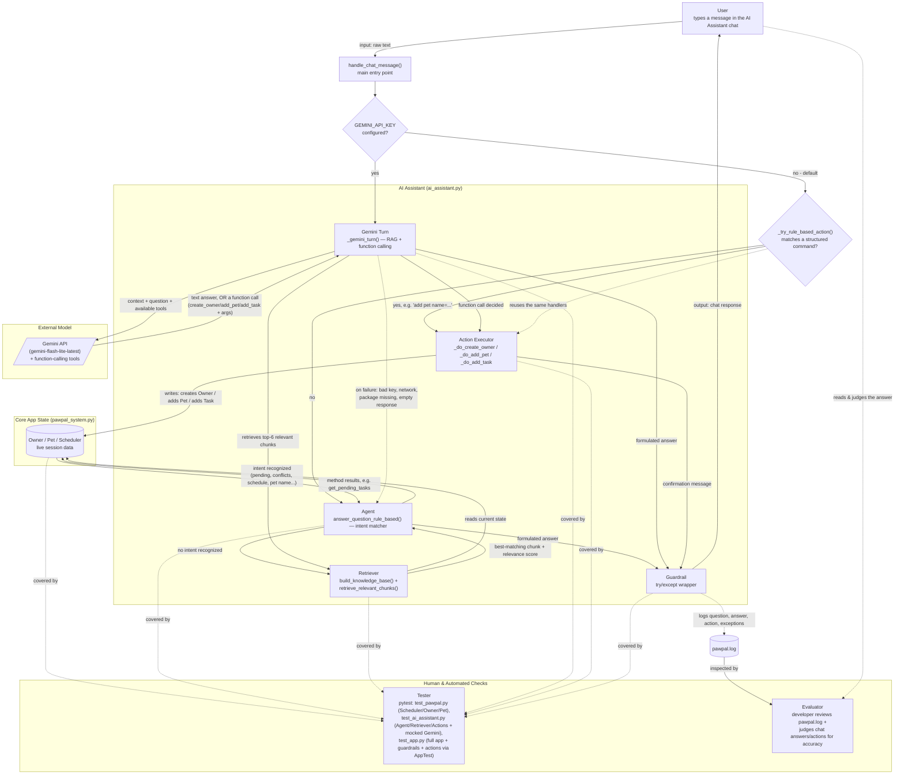

# PawPal+ (Module 2 Project)

You are building **PawPal+**, a Streamlit app that helps a pet owner plan care tasks for their pet.

## Summary

PawPal+ is a Streamlit app that helps a pet owner track pet care tasks (walks, feeding, meds, grooming, etc.), catches scheduling conflicts before they cause a missed or double-booked task, and automatically reschedules recurring tasks when they're completed. As of this phase, it also includes an AI Assistant that lets the owner ask plain-English questions about that same data — pets, tasks, conflicts, today's schedule — instead of scanning tables by hand. It matters because pet care is easy to lose track of across multiple pets and recurring routines; PawPal+ turns that into one place that both organizes the schedule and can answer questions about it on demand.

## Original Project (Modules 1-3)

The original project, **PawPal+**, was built across Modules 1-3 as a Streamlit app for pet care scheduling. Its goals were to let an owner register pets and care tasks, generate a daily schedule sorted by time, automatically flag same-pet/same-time scheduling conflicts, and handle recurring tasks by scheduling the next occurrence whenever one is marked complete. That logic lives in `pawpal_system.py` (`Owner`, `Pet`, `Task`, `Scheduler`) and is verified by the `tests/test_pawpal.py` suite.

## Architecture Overview

`diagrams/architecture.mmd` diagrams how the AI Assistant feature fits into the app (rendered below). Every message goes through `handle_chat_message()`, the single entry point. If `GEMINI_API_KEY` is configured, it goes to **Gemini Turn** (`_gemini_turn()`): the **Retriever** selects the top-6 most relevant chunks of the app's live data, Gemini gets them as context plus a set of function-calling tools scoped to what's actually valid right now (e.g. it can't be offered `add_task` before any pet exists), and Gemini either returns a natural-language answer or decides to call a function. If it calls one, the **Action Executor** performs the real mutation — creating an `Owner`, adding a `Pet`, or adding a `Task` — directly on the app's live data; this is a genuine write path, not just retrieval. Otherwise (the default, or if Gemini fails for any reason), the message first goes to `_try_rule_based_action()`, a structured-command matcher (e.g. `add pet name=Rex species=Dog ...`) that reuses the exact same Action Executor; if it doesn't match a command, it falls through to the **Agent** (`answer_question_rule_based()`), which matches a known intent and either calls the relevant method directly on the live data or, via the Retriever, hands back the single best-matching chunk instead of a generic reply. Every answer or action confirmation, from any path, passes through a **Guardrail** (`try/except`) before reaching the user, and questions, answers, actions, and any exceptions are logged to `pawpal.log`. A **Tester** (`pytest`) verifies the underlying `Scheduler`/`Owner`/`Pet` logic (`tests/test_pawpal.py`), the Agent, Retriever, and Gemini/action dispatch logic — the Gemini API itself is mocked so tests run offline and deterministically (`tests/test_ai_assistant.py`) — and the Guardrail plus full app workflow, including actions performed through the real UI, end-to-end (`tests/test_app.py`, via Streamlit's `AppTest`). An **Evaluator** (a developer reviewing `pawpal.log`, plus the user themselves reading each answer or checking that an action actually happened) is the human check on whether the AI is actually behaving correctly.



## Scenario

A busy pet owner needs help staying consistent with pet care. They want an assistant that can:

- Track pet care tasks (walks, feeding, meds, enrichment, grooming, etc.)
- Consider constraints (time available, priority, owner preferences)
- Produce a daily plan and explain why it chose that plan

Your job is to design the system first (UML), then implement the logic in Python, then connect it to the Streamlit UI.

## What you will build

Your final app should:

- Let a user enter basic owner + pet info
- Let a user add/edit tasks (duration + priority at minimum)
- Generate a daily schedule/plan based on constraints and priorities
- Display the plan clearly (and ideally explain the reasoning)
- Include tests for the most important scheduling behaviors

## Getting started

### Setup

```bash
python -m venv .venv
source .venv/bin/activate  # Windows: .venv\Scripts\activate
pip install -r requirements.txt
```

Requires Python 3.9+.

### Run the app

```bash
streamlit run app.py
```

This opens the app in your browser (usually `http://localhost:8501`). No API keys or other configuration are required — by default the AI Assistant runs entirely locally with no network calls.

**Optional — Gemini-powered answers:** set a `GEMINI_API_KEY` (environment variable, or `.streamlit/secrets.toml`) to have the AI Assistant answer via Gemini instead, using retrieval-augmented generation over the same app data. Without a key, or if the Gemini call fails for any reason, it automatically falls back to the rule-based answers described below — the assistant never goes silent.

### Suggested workflow

1. Read the scenario carefully and identify requirements and edge cases.
2. Draft a UML diagram (classes, attributes, methods, relationships).
3. Convert UML into Python class stubs (no logic yet).
4. Implement scheduling logic in small increments.
5. Add tests to verify key behaviors.
6. Connect your logic to the Streamlit UI in `app.py`.
7. Refine UML so it matches what you actually built.

## 🖥️ Sample Output

Paste a sample of your app's CLI or Streamlit output here so a reader can see what a generated plan looks like:

```
========================================
        PawPal — Today's Schedule
========================================

Buddy (Golden Retriever)
------------------------------
  [Pending] Morning walk at 7:00 AM (daily)
  [Pending] Feed breakfast at 8:00 AM (daily)
  [Pending] Evening walk at 6:00 PM (daily)

Luna (Siamese)
------------------------------
  [Pending] Feed breakfast at 8:30 AM (daily)
  [Pending] Clean litter box at 12:00 PM (daily)
  [Pending] Brush fur at 5:00 PM (weekly)

========================================
Total pending tasks: 6
========================================  ...
```

## 🧪 Testing PawPal+

```bash
# Run the full test suite:
pytest
# (equivalent: python -m pytest)

# Run with coverage:
pytest --cov
```

The tests cover sorting, recurrence of tasks, conflict detection, the AI Assistant's intent-matching and retrieval logic (`tests/test_ai_assistant.py`), and full end-to-end app/guardrail behavior via Streamlit's `AppTest` harness (`tests/test_app.py`).

Sample test output:

```
=============== test session starts ===============
platform win32 -- Python 3.14.5, pytest-9.0.3, pluggy-1.6.0
rootdir: C:\Users\sajja\Downloads\ai110-module2show-pawpal-starter
plugins: anyio-4.13.0
collected 12 items                                 

tests\test_pawpal.py ............            [100%]

=============== 12 passed in 0.14s ================
```

## 📐 Smarter Scheduling

> Fill in once you've implemented scheduling logic.

| Feature | Method(s) | Notes |
|---------|-----------|-------|
| Task sorting |sort_by_time() | e.g., by priority, duration |
| Filtering | filter_tasks()| e.g., skip tasks if time runs out |
| Conflict handling |detect_conflicts() | e.g., overlapping time slots |
| Recurring tasks | _schedule_next() | e.g., daily vs. weekly |

## 📸 Demo Walkthrough

### UI features

The Streamlit app (`app.py`) is organized into four sections, plus an AI Assistant pinned at the top:

- **AI Assistant** — click "🤖 AI Assistant" to open a chat panel where you can ask questions about the owner, pets, tasks, and schedule in plain English. Rule-based by default (no external API/LLM/key required), with an optional Gemini-powered mode — see the "🤖 AI Assistant" section below for details.
- **Owner** — enter a name, email, and phone number and click "Create Owner." Once created, the owner's contact info is displayed below the form.
- **Add a Pet** — enter a pet's name, species, breed, age, and weight and click "Add Pet." Registered pets appear in a table as they're added.
- **Schedule a Task** — pick a pet, describe the task, set a time and frequency (`daily`, `weekly`, or `monthly`), and click "Add Task" to attach it to that pet. Times must be in `H:MM AM/PM` format (e.g. `8:00 AM`) — invalid formats are rejected with an on-screen error instead of crashing the app.
- **Today's Schedule** — shows each pet's pending tasks sorted chronologically, surfaces any scheduling conflicts as warnings, and provides a "Mark Done" control to complete a task on the spot.

### Example workflow

1. Create an owner (e.g., "Jordan").
2. Add a pet (e.g., "Mochi," a Shiba Inu).
3. Schedule a task for Mochi — e.g., "Morning walk" at 8:00 AM, daily.
4. Open "Today's Schedule" to see Mochi's task listed alongside any other pets' tasks, sorted by time.
5. Click "Mark Done" on the task — the Scheduler marks it complete and, for daily/weekly tasks, automatically schedules the next occurrence.

### Key Scheduler behaviors shown

- **Sorting** — `sort_by_time()` orders every pet's task list chronologically, regardless of the order tasks were entered in.
- **Conflict warnings** — `detect_conflicts()` displays a warning banner whenever two tasks for the same pet share the same time and date (e.g. two 6:00 PM tasks).
- **Filtering** — `filter_tasks()` powers the pending-only view, so completed tasks drop out of the schedule automatically.
- **Recurrence** — clicking "Mark Done" on a daily/weekly task calls `complete_task()`, which schedules that task's next occurrence behind the scenes.

### Sample CLI output (`python main.py`)

```
==================================================
  Conflict Detection
==================================================
  WARNING: Buddy has a time conflict at 6:00 PM on 2026-06-30 — "Evening walk" and "Feed dinner"

==================================================
  Today's Full Schedule (sorted by time)
==================================================
  [Pending] Morning walk at 7:00 AM on 2026-06-30 (daily)
  [Pending] Feed breakfast at 8:00 AM on 2026-06-30 (daily)
  [Pending] Feed breakfast at 8:30 AM on 2026-06-30 (daily)
  [Pending] Clean litter box at 12:00 PM on 2026-06-30 (daily)
  [Pending] Brush fur at 5:00 PM on 2026-06-30 (weekly)
  [Pending] Evening walk at 6:00 PM on 2026-06-30 (daily)
  [Pending] Feed dinner at 6:00 PM on 2026-06-30 (daily)
```

## 🤖 AI Assistant

A chat panel (`ai_assistant.py`) that answers questions about the current owner, pets, tasks, and schedule — conversationally, not as a data dump — and can also act on your behalf: create an owner profile, add a pet, or schedule a task. Two modes, chosen automatically:

- **Default (no `GEMINI_API_KEY` set) — rule-based, fully offline.** Questions are matched to an intent (a pet's name, "pending," "conflicts," "schedule," etc.) and answered directly from `Owner`/`Pet`/`Scheduler` data in natural sentences (e.g. "Mochi still needs to: Morning walk at 8:00 AM (daily)."), not raw field dumps. Actions use a small structured command syntax, e.g. `add pet name=Rex species=Dog breed=Labrador age=3 weight=60` — deterministic and testable without needing an LLM to parse free text.
- **Optional (`GEMINI_API_KEY` set) — Gemini-powered RAG plus real actions.** The same retrieval step (`build_knowledge_base()` + `retrieve_relevant_chunks()`) selects the most relevant chunks of the app's live data, which are handed to Gemini (`gemini-flash-lite-latest`) as context — Gemini is explicitly instructed to paraphrase in its own words rather than copy the context verbatim, so it actually sounds conversational. For actions, Gemini decides — via real function calling, not text parsing — whether the user is asking it to create an owner, add a pet, or schedule a task, and with what arguments; this code then performs the actual mutation. Only the actions that are valid for the current state are ever offered (e.g. it can't be tempted to add a task before any pet exists). If the Gemini call fails for any reason (bad key, no network, package missing), it automatically falls back to the same rule-based path (including its own structured-command action parser) — the assistant never goes silent or crashes.

Try asking or telling it things like:

- "What tasks does Mochi have?"
- "Are there any scheduling conflicts?"
- "Add a pet named Rex, a 3 year old Labrador that weighs 60 pounds." *(Gemini mode — natural language)* or `add pet name=Rex species=Dog breed=Labrador age=3 weight=60` *(rule-based mode — structured command)*
- "Schedule a daily dinner feeding for Mochi at 6pm."

The panel stays open across questions and only closes when you click the "✕" button.

### Sample Interactions

These are real captured input/output pairs, demonstrating that the assistant is actually functional rather than a static demo — the first four are rule-based (offline, deterministic); the last three are genuine live calls to the real Gemini API (not mocked), shown to demonstrate both the conversational tone and the agentic actions actually working:

> **Q:** "What tasks does Mochi have?" *(rule-based)*
> **A:** "Mochi has 1 task: Morning walk at 8:00 AM (daily) — pending."

> **Q:** "Are there any conflicts?" *(rule-based)*
> **A:** "No scheduling conflicts detected."

> **Q:** "Tell me about Jordan" *(rule-based, no keyword intent matches — exercises the retrieval fallback)*
> **A:** "The owner is Jordan, reachable at jordan@email.com or 555-0100."

> **Q:** "asdkjaskdj random gibberish" *(rule-based, nothing in the app's data is relevant)*
> **A:** "I couldn't find anything relevant to that in the app's current data. Try asking about a pet's tasks, pending/completed status, scheduling conflicts, or today's schedule."

> **Q:** "What tasks does Mochi have?" *(Gemini mode, live)*
> **A:** "Mochi has one pending task right now: a morning walk scheduled for 8:00 AM every day."

> **Q:** "Please add a pet named Rex, a 3 year old Labrador that weighs 60 pounds." *(Gemini mode, live — real action, not a text response)*
> **A:** "Done — I've added Rex, a 3-year-old Dog (Labrador), to your pets." *(verified: `owner.pets` actually gained a real `Pet(name="Rex", ...)` — this is Gemini calling the `add_pet` function with extracted arguments, not just describing an action.)*

> **Q:** "Can you schedule a daily dinner feeding for Mochi at 6pm?" *(Gemini mode, live — real action)*
> **A:** "Done — I've scheduled 'Dinner feeding' for Mochi at 6:00 PM (daily)." *(verified: `pet.tasks` actually gained a real `Task(...)`.)*

## 📝 Logging

The app logs key actions (owner/pet/task creation, task completion, rejected invalid input, AI Assistant questions) to `pawpal.log` in the project root, via Python's standard `logging` module. This file is gitignored and regenerates on each run — check it if something doesn't behave as expected.

## Design Decisions

- **Rule-based by default, LLM as an opt-in, not the baseline.** The assistant was originally built calling the Claude API, then rebuilt to answer entirely from keyword/intent matching over the app's own data — no API key, no network call, no per-query cost, and answers that can never be inconsistent with the app's actual data since they're computed directly from it. A Gemini-powered RAG mode was later added on top as an *optional upgrade* (used only when `GEMINI_API_KEY` is set), rather than replacing the rule-based path — so the reliability properties of the default mode (offline, free, deterministic) aren't lost for anyone who doesn't configure a key, and any Gemini failure (bad key, network, missing package) transparently falls back to the same rule-based answer instead of the assistant going silent. Trade-off: the rule-based path still can't paraphrase or handle odd phrasing as gracefully as Gemini can when it's active.
- **Fallback returns the single best-matching chunk, not a list.** An earlier version of the retrieval fallback prepended a generic "I'm not sure..." disclaimer and dumped several ranked chunks underneath it. That's exactly the "printing retrieved data alongside a standard answer" anti-pattern rather than the AI actively using it — it was changed to return only the top-ranked chunk directly as the answer, and only falls back to guidance text when nothing is actually relevant (score 0).
- **The assistant is pinned inline at the top of the page instead of floating.** The first attempt used CSS `position: fixed` to make it a floating bottom-right chat bubble. That silently failed: Streamlit wraps blocks in wrapper divs that use CSS `transform` for its rerun animations, which changes what `position: fixed` is measured relative to and effectively clips the element off-screen instead of just repositioning it — a known limitation of building floating widgets in Streamlit with plain CSS. Trade-off: placing it inline at the top isn't a true floating overlay, but it's guaranteed to render, needs no CSS hacks, and means the user never has to scroll to reach it or see its latest answer anyway.
- **Custom session-state panel instead of `st.popover`.** `st.popover` was tried first since it's the built-in Streamlit widget for this. It has two problems for a chat use case: its open/closed state isn't controlled by the app, so submitting a message via `st.chat_input` closed it every time, and its content area has its own internal max-height/scroll behavior that kept the latest answer scrolled out of view. Replacing it with a plain container gated on a `st.session_state` boolean — cleared only by an explicit "✕" button — gives full control over both behaviors at the cost of losing the popover's built-in click-outside-to-dismiss convenience.
- **Explicit conversational-tone instructions, not just "be concise."** The first Gemini prompt asked it to "answer using only the context" and "be concise" — in practice this made Gemini paraphrase almost nothing, sometimes returning the retrieved chunk nearly verbatim, which read exactly like the rule-based path's data-dump problem it was supposed to avoid. The prompt now explicitly instructs it to rephrase in its own words and vary its phrasing, verified live to actually change the output (e.g. "Mochi has one pending task right now: a morning walk scheduled for 8:00 AM every day." instead of a copy of the context sentence). The rule-based templates were rewritten the same way — natural sentences built from task/pet fields, instead of bullet-listing `get_summary()`/`get_profile()`'s raw formatted strings.
- **Actions via real function calling, not text parsing of the model's reply.** To let the assistant actually create an owner, add a pet, or schedule a task, the alternative would have been asking Gemini to reply with something like a JSON blob to parse — fragile, and one more place for the model to say something not-quite-parseable. Using Gemini's native function-calling instead means the model returns a structured `(function_name, arguments)` pair directly; the code decides whether to trust it (validating age/weight/time formats before mutating anything) rather than trying to extract intent from prose. The same action handlers are reused by a small structured-command parser in the rule-based mode (e.g. `add pet name=Rex species=Dog breed=Labrador age=3 weight=60`), so both modes can genuinely act, not just answer — deliberately at the cost of the rule-based mode requiring a fixed command syntax rather than free-form phrasing, since a non-LLM parser can't reliably extract slots from arbitrary natural language.
- **Only offer actions that are valid for the current state.** Gemini's available tools change based on real app state — `create_owner` is only offered when no owner exists yet, and `add_task` is only offered once at least one pet exists — rather than exposing all three actions unconditionally and relying on the model's judgment (or a system-prompt instruction) to avoid calling `add_task` with no pets around. Removing an invalid action from what the model can even choose is a stronger guarantee than asking it not to pick it.

## Testing Summary

**Automated tests:** `tests/test_ai_assistant.py` has 43 unit tests calling `answer_question()`/`handle_chat_message()`/`retrieve_relevant_chunks()` directly — every Q&A intent (owner info, pet list, conflicts, schedule, pending/completed per pet, aggregate totals), edge cases (no owner, no pets, a pet with no tasks), the retrieval fallback (both a real match and a genuinely irrelevant query), a guardrail test asserting the assistant never raises or returns an empty string on degenerate input (`""`, whitespace, punctuation-only, emoji, a 500-character string), the Gemini/rule-based dispatch logic, and the agentic actions — both the rule-based structured-command parser and Gemini function calling (mocked, including an unrecognized-function case and a Gemini-unreachable-mid-action case), verifying each action actually mutates `Owner`/`Pet`/`Task` state correctly. `tests/test_app.py` adds 9 full-UI tests via Streamlit's `AppTest` (including 3 that drive an actual add-owner/add-pet/add-task conversation through the real running app, not just the underlying functions). Combined with the original `tests/test_pawpal.py` (12 tests for sorting, recurrence, and conflict detection), the full suite is:

> **64 of 64 automated tests pass.** Writing them surfaced two real bugs. First, the tokenizer glued possessive `'s` onto words (e.g. "Mochi's" → one token `"mochi's"`), which silently broke pet-name recognition for natural phrasing like *"What are Mochi's tasks?"* — fixed (dropped apostrophes from the token pattern) and covered by a dedicated regression test. Second, adding real agentic actions surfaced that Gemini's plain-text answers were sometimes reciting the retrieved context nearly verbatim rather than conversationally — fixed by strengthening the system prompt, and verified with a real (non-mocked) call to the live API rather than just trusting the prompt wording. No tests are currently failing.

**Confidence scoring:** the retrieval fallback computes a lexical relevance score (count of overlapping words) for the best-matching chunk and logs it (`pawpal.log`) with every fallback answer. A score of 0 means nothing in the app's data was relevant, in which case the assistant admits that instead of guessing; a score above 0 means it found and returned real matching data.

**Human evaluation** (manually run against the live app and judged for correctness):

| Test Input | Evaluation Criteria | Result |
|---|---|---|
| "What tasks does Mochi have?" | Lists that pet's actual tasks, with status and time | Pass |
| "Are there any conflicts?" | Reports no conflicts when none exist | Pass |
| Two same-pet tasks at the same time, then "any conflicts?" | Conflict is detected and names both tasks correctly | Pass |
| "Tell me about Jordan" (no intent keyword matches) | Fallback returns the single most relevant real data directly, not a generic disclaimer + data dump | Pass |
| "asdkjaskdj random gibberish" | Handles irrelevant input gracefully — no crash, no fabricated answer | Pass |
| Invalid task time, e.g. "8am" | Rejected with an on-screen error; app does not crash | Pass |
| "What are Mochi's tasks?" (possessive phrasing) | Pet name recognized despite the `'s` | Fail — initially not recognized (tokenizer bug); Pass after fix |
| Empty / whitespace / emoji-only chat input | No exception, always returns a non-empty string | Pass |
| "What tasks does Mochi have?" with a real `GEMINI_API_KEY` configured | Gemini mode activates ("Powered by Gemini" caption), gives a conversational (not verbatim-context) answer, no exception | Fail — initially just echoed the context sentence verbatim; Pass after strengthening the system prompt — real reply: *"Mochi has one pending task right now: a morning walk scheduled for 8:00 AM every day."* |
| `add pet name=Rex species=Dog breed=Labrador age=3 weight=60` (rule-based, no key) | Pet is actually added to `owner.pets`, confirmation names it correctly | Pass |
| `add pet name=Rex` (rule-based, missing fields) | Asks for exactly the missing fields instead of crashing or guessing; nothing added | Pass |
| `add task pet=Mochi description="Feed dinner" time="6pm" frequency=daily` (rule-based, invalid time) | Same time-format guardrail as the main UI applies — rejected, task not added | Pass |
| "Please add a pet named Rex, a 3 year old Labrador that weighs 60 pounds." with a real `GEMINI_API_KEY` | Gemini calls the real `add_pet` function (not just describing the action); `owner.pets` actually gains a new `Pet` | Pass — real reply: *"Done — I've added Rex, a 3-year-old Dog (Labrador), to your pets."* |
| "Can you schedule a daily dinner feeding for Mochi at 6pm?" with a real `GEMINI_API_KEY` | Gemini calls the real `add_task` function; `pet.tasks` actually gains a new `Task` | Pass — real reply: *"Done — I've scheduled 'Dinner feeding' for Mochi at 6:00 PM (daily)."* |

**What didn't work initially, and what it taught us:** several real bugs here. A floating CSS chat bubble that silently failed to render (Streamlit's rerun-animation wrapper divs break `position: fixed`), and `st.popover` closing itself on every chat submission, were invisible to both pytest and `AppTest`, since neither evaluates actual browser CSS/layout behavior — they only surfaced from hands-on use of the running app. Separately, when wiring up a real Gemini key: the hardcoded model name (`gemini-2.5-flash`) turned out to be deprecated for new API keys, discovered only by actually calling the live API and reading the error rather than by any test (fixed by switching to `gemini-flash-latest`); that model turned out to have a **20-requests/day** free-tier quota, discovered only after a real chat session hit `RESOURCE_EXHAUSTED` mid-conversation — a normal chat could exhaust it in one sitting and silently fall back to rule-based answers with no obvious explanation (fixed by switching to `gemini-flash-lite-latest`, a lighter tier with a workable quota, verified live before committing to it); and adding a real key to `.streamlit/secrets.toml` broke several existing tests, which had only ever verified "no key present" by relying on the ambient absence of one rather than forcing it — they silently started making real, slow, non-deterministic Gemini calls (fixed by mocking the key-lookup function directly in every test). Separately, real usage surfaced that even a working Gemini integration was just reciting the retrieved context verbatim instead of answering conversationally, and that the assistant could only answer questions, not act — both fixed by strengthening the system prompt to require paraphrasing and by adding Gemini function calling (plus a matching structured-command parser for the rule-based mode) so the assistant can actually create an owner, add a pet, or schedule a task. The lesson: logic-level automated tests are necessary but not sufficient — they catch behavioral/data bugs (the possessive-tokenizer bug) reliably, but rendering/layout bugs need a real browser, and external-dependency bugs (a deprecated model, an unexpectedly tiny quota, tests coupled to ambient machine state) need an actual live call against the real service to surface at all.

## 🧾 Reproducible Execution Evidence

Everything below is real, verbatim output captured by actually running the commands shown — not a description of what should happen. The end-to-end run and the guardrail checks below are permanently codified as real, rerunnable tests in `tests/test_app.py` (not one-off scripts) — clone the repo and run `pytest tests/test_app.py -v` to reproduce them yourself.

### End-to-end system run (3 inputs)

This walks through the core app itself, start to finish: create an owner, add a pet, schedule a task, and see the resulting schedule/conflict check — each input paired directly with its actual output, captured via Streamlit's `AppTest` harness (which executes `app.py` exactly as a real browser session would, not a mock). This exact flow is `tests/test_app.py::test_end_to_end_owner_pet_task_workflow`.

**Input 1 — Create Owner** (name=`Jordan`, email=`jordan@email.com`, phone=`555-0100`):
```
Output: ["Owner 'Jordan' created!", "No schedule yet. Add pets and tasks above."]
```

**Input 2 — Add Pet** (name=`Mochi`, species=`Dog`, breed=`Shiba Inu`, age=`2`, weight=`15.0`):
```
Output: ["Mochi added!", "No scheduling conflicts detected.", "Mochi has no pending tasks. All caught up!"]
```

**Input 3 — Schedule a Task** (pet=`Mochi`, description=`Morning walk`, time=`8:00 AM`, frequency=`daily`):
```
Output: ["Task 'Morning walk' added to Mochi!", "No scheduling conflicts detected."]
Total pending tasks metric: 1
```

Three inputs, three real outputs, ending in a consistent, correct app state — the schedule reflects exactly the one task just added, with no false conflicts reported.

### Sample command execution: launching the app

```bash
$ streamlit run app.py
```

```
2026-07-27 15:37:54.014 Uvicorn server started on 0.0.0.0:8501

  You can now view your Streamlit app in your browser.

  Local URL: http://localhost:8501
  Network URL: http://192.168.1.19:8501
  External URL: http://68.9.134.220:8501
```

### Example inputs and outputs: AI Assistant (Agent + Retriever behavior)

This demonstrates the rule-based mode — the two-part architecture from the [Architecture Overview](#architecture-overview) actually firing: the first two questions are answered by the **Agent** matching a known intent and calling a live `Owner`/`Pet`/`Scheduler` method directly; the last two fall through to the **Retriever**, which ranks the app's own data by relevance to the question instead of the Agent returning a canned reply — proving the retrieved data is what drives the answer, not just text printed alongside a generic response.

Reproduce with (the key lookup is forced to `None` so this reproduces the rule-based path specifically, regardless of whether the machine running it happens to have its own `GEMINI_API_KEY` configured — without that, a reader with a real key would silently get Gemini's answers instead of this exact output):

```python
import ai_assistant
ai_assistant._get_gemini_api_key = lambda: None  # force rule-based for this demo

from pawpal_system import Owner, Pet, Task
from ai_assistant import answer_question

owner = Owner(name="Jordan", email="jordan@email.com", phone="555-0100")
pet = Pet(name="Mochi", species="Dog", breed="Shiba Inu", age=2, weight=15.0)
pet.add_task(Task(description="Morning walk", time="8:00 AM", frequency="daily"))
owner.add_pet(pet)

questions = [
    "What tasks does Mochi have?",
    "Are there any conflicts?",
    "Tell me about Jordan",
    "asdkjaskdj random gibberish",
]

for q in questions:
    print(f"Q: {q}")
    print(f"A: {answer_question(q, owner)}")
    print()
```

Captured output (mechanism noted per case — not part of the actual program output, added here for clarity):

```
Q: What tasks does Mochi have?                     [Agent: pet-name + task intent matched]
A: Mochi has 1 task: Morning walk at 8:00 AM (daily) — pending.

Q: Are there any conflicts?                        [Agent: conflict intent matched]
A: No scheduling conflicts detected.

Q: Tell me about Jordan                            [Retriever: no intent matched, fell back to retrieval]
A: The owner is Jordan, reachable at jordan@email.com or 555-0100.

Q: asdkjaskdj random gibberish                     [Retriever: fell back to retrieval, found nothing relevant]
A: I couldn't find anything relevant to that in the app's current data. Try asking about a pet's tasks, pending/completed status, scheduling conflicts, or today's schedule.
```

### Example inputs and outputs: Gemini mode, conversational tone and real actions (verified live, not mocked)

These are genuine calls to the live Gemini API through `handle_chat_message()` (not `answer_question()`, which only answers — this exercises the full agentic path, including real function calling), using the same owner/pet data as above, captured verbatim:

```
Q: What tasks does Mochi have?
A: Mochi has one pending task right now: a morning walk scheduled for 8:00 AM every day.
```

Compare this to the rule-based answer to the identical question above ("Mochi has 1 task: Morning walk at 8:00 AM (daily) — pending.") — same underlying data, genuinely different (paraphrased, natural-language) generation, confirming Gemini is actually composing the answer rather than reciting the retrieved chunk. (An earlier version of the prompt didn't enforce this and Gemini would echo the context almost verbatim — see Testing Summary.)

```
Q: Please add a pet named Rex, a 3 year old Labrador that weighs 60 pounds.
A: Done — I've added Rex, a 3-year-old Dog (Labrador), to your pets.

Verified directly against app state (not just the reply text):
>>> [p.name for p in owner.pets]
['Mochi', 'Rex']
```

```
Q: Can you schedule a daily dinner feeding for Mochi at 6pm?
A: Done — I've scheduled 'Dinner feeding' for Mochi at 6:00 PM (daily).

Verified directly against app state:
>>> [(t.description, t.time, t.frequency) for t in pet.tasks]
[('Dinner feeding', '6:00 PM', 'daily')]
```

These two confirm the "substantial AI feature" requirement isn't just RAG answering questions — Gemini is deciding to call a real Python function with extracted arguments, and that function is genuinely mutating the app's live `Owner`/`Pet`/`Task` objects, not just producing text that describes doing so.

### Reliability/guardrail results

Full automated test suite, run fresh (`pytest -v`), current as of the agentic-actions update — `tests/test_pawpal.py` (original scheduling logic), `tests/test_ai_assistant.py` (Agent/Retriever/action logic, plus Gemini dispatch, function-calling actions, and fallback behavior — with the Gemini API itself mocked so tests run offline and deterministically), and `tests/test_app.py` (full app + guardrails + actions performed through the real running UI, via `AppTest`):

```
============================= test session starts =============================
platform win32 -- Python 3.14.5, pytest-9.0.3, pluggy-1.6.0
rootdir: C:\Users\sajja\Downloads\applied-ai-system-project
plugins: anyio-4.13.0, cov-7.1.0
collecting ... collected 64 items

tests/test_ai_assistant.py::test_answers_gracefully_when_no_owner_exists PASSED [  1%]
tests/test_ai_assistant.py::test_answers_gracefully_when_owner_has_no_pets PASSED [  3%]
tests/test_ai_assistant.py::test_greeting_returns_example_questions PASSED [  4%]
tests/test_ai_assistant.py::test_help_describes_capabilities PASSED      [  6%]
tests/test_ai_assistant.py::test_owner_intent_returns_contact_info PASSED [  7%]
tests/test_ai_assistant.py::test_pet_list_intent_lists_all_pets PASSED   [  9%]
tests/test_ai_assistant.py::test_conflict_intent_reports_no_conflicts PASSED [ 10%]
tests/test_ai_assistant.py::test_conflict_intent_reports_actual_conflict PASSED [ 12%]
tests/test_ai_assistant.py::test_schedule_intent_returns_daily_schedule PASSED [ 14%]
tests/test_ai_assistant.py::test_pet_tasks_intent_lists_tasks_for_named_pet PASSED [ 15%]
tests/test_ai_assistant.py::test_pet_name_recognized_in_possessive_form PASSED [ 17%]
tests/test_ai_assistant.py::test_pet_pending_intent_when_task_incomplete PASSED [ 18%]
tests/test_ai_assistant.py::test_pet_pending_intent_when_all_caught_up PASSED [ 20%]
tests/test_ai_assistant.py::test_pet_completed_intent_lists_completed_tasks PASSED [ 21%]
tests/test_ai_assistant.py::test_pet_completed_intent_when_none_completed PASSED [ 23%]
tests/test_ai_assistant.py::test_pet_with_no_tasks_reports_that_directly PASSED [ 25%]
tests/test_ai_assistant.py::test_pending_intent_without_pet_name_totals_across_all_pets PASSED [ 26%]
tests/test_ai_assistant.py::test_task_word_without_pet_name_lists_every_task PASSED [ 28%]
tests/test_ai_assistant.py::test_fallback_surfaces_relevant_data_directly_when_no_intent_matches PASSED [ 29%]
tests/test_ai_assistant.py::test_fallback_gives_guidance_when_nothing_is_relevant PASSED [ 31%]
tests/test_ai_assistant.py::test_retrieve_relevant_chunks_ranks_by_word_overlap PASSED [ 32%]
tests/test_ai_assistant.py::test_retrieve_relevant_chunks_returns_zero_score_when_nothing_matches PASSED [ 34%]
tests/test_ai_assistant.py::test_answer_question_never_raises_on_odd_input PASSED [ 35%]
tests/test_ai_assistant.py::test_get_gemini_api_key_reads_environment_variable PASSED [ 37%]
tests/test_ai_assistant.py::test_answer_question_uses_rule_based_path_when_no_key PASSED [ 39%]
tests/test_ai_assistant.py::test_answer_question_routes_to_gemini_when_key_is_present PASSED [ 40%]
tests/test_ai_assistant.py::test_gemini_failure_falls_back_to_rule_based_answer PASSED [ 42%]
tests/test_ai_assistant.py::test_gemini_empty_response_falls_back_to_a_safe_message PASSED [ 43%]
tests/test_ai_assistant.py::test_rule_based_action_creates_owner PASSED  [ 45%]
tests/test_ai_assistant.py::test_rule_based_action_create_owner_when_one_already_exists PASSED [ 46%]
tests/test_ai_assistant.py::test_rule_based_action_adds_pet PASSED       [ 48%]
tests/test_ai_assistant.py::test_rule_based_action_add_pet_asks_for_missing_fields PASSED [ 50%]
tests/test_ai_assistant.py::test_rule_based_action_add_pet_without_owner PASSED [ 51%]
tests/test_ai_assistant.py::test_rule_based_action_adds_task PASSED      [ 53%]
tests/test_ai_assistant.py::test_rule_based_action_add_task_rejects_invalid_time PASSED [ 54%]
tests/test_ai_assistant.py::test_rule_based_action_add_task_unknown_pet PASSED [ 56%]
tests/test_ai_assistant.py::test_handle_chat_message_falls_through_to_normal_qa_when_not_an_action PASSED [ 57%]
tests/test_ai_assistant.py::test_gemini_action_add_pet_executes_and_mutates_state PASSED [ 59%]
tests/test_ai_assistant.py::test_gemini_action_add_task_executes_and_mutates_state PASSED [ 60%]
tests/test_ai_assistant.py::test_gemini_action_create_owner_executes_and_mutates_state PASSED [ 62%]
tests/test_ai_assistant.py::test_gemini_plain_question_still_returns_text_not_an_action PASSED [ 64%]
tests/test_ai_assistant.py::test_gemini_unrecognized_function_falls_back_to_rule_based PASSED [ 65%]
tests/test_ai_assistant.py::test_gemini_failure_during_action_turn_falls_back_to_rule_based_action PASSED [ 67%]
tests/test_app.py::test_app_loads_without_exceptions PASSED              [ 68%]
tests/test_app.py::test_end_to_end_owner_pet_task_workflow PASSED        [ 70%]
tests/test_app.py::test_invalid_task_time_is_rejected_without_crashing PASSED [ 71%]
tests/test_app.py::test_valid_task_time_is_accepted_after_a_rejection PASSED [ 73%]
tests/test_app.py::test_ai_assistant_opens_and_stays_open_across_chat_submission PASSED [ 75%]
tests/test_app.py::test_ai_assistant_closes_only_via_close_button PASSED [ 76%]
tests/test_app.py::test_ai_assistant_can_add_a_pet_via_chat PASSED       [ 78%]
tests/test_app.py::test_ai_assistant_can_add_a_task_via_chat PASSED      [ 79%]
tests/test_app.py::test_ai_assistant_can_create_owner_via_chat_when_none_exists PASSED [ 81%]
tests/test_pawpal.py::test_mark_complete_changes_status PASSED           [ 82%]
tests/test_pawpal.py::test_add_task_increases_pet_task_count PASSED      [ 84%]
tests/test_pawpal.py::test_sort_by_time_orders_chronologically PASSED    [ 85%]
tests/test_pawpal.py::test_sort_by_time_handles_midnight_and_noon_boundary PASSED [ 87%]
tests/test_pawpal.py::test_sort_by_time_does_not_mutate_original_list PASSED [ 89%]
tests/test_pawpal.py::test_complete_daily_task_creates_next_day_occurrence PASSED [ 90%]
tests/test_pawpal.py::test_complete_weekly_task_creates_next_week_occurrence PASSED [ 92%]
tests/test_pawpal.py::test_complete_monthly_task_does_not_recur PASSED   [ 93%]
tests/test_pawpal.py::test_complete_task_returns_false_for_unknown_pet_or_task PASSED [ 95%]
tests/test_pawpal.py::test_detect_conflicts_flags_duplicate_times_for_same_pet PASSED [ 96%]
tests/test_pawpal.py::test_detect_conflicts_ignores_same_time_on_different_pets PASSED [ 98%]
tests/test_pawpal.py::test_detect_conflicts_returns_empty_when_no_overlap PASSED [100%]

============================== warnings summary ================================
google/genai/types.py:42
  DeprecationWarning: '_UnionGenericAlias' is deprecated and slated for removal in Python 3.17 (harmless, from the google-genai package itself, not this project's code)

============================= 64 passed in 4.87s ==============================
```

Guardrail check — this is `tests/test_app.py::test_invalid_task_time_is_rejected_without_crashing` and `test_valid_task_time_is_accepted_after_a_rejection`, shown here run standalone against the live app via Streamlit's `AppTest` harness for a clearer before/after view (submitting an invalid time, then a valid one):

```
--- Invalid time ("8am") submitted ---
Exception raised: False
On-screen error shown: ["'8am' isn't a valid time. Use the format 'H:MM AM/PM', e.g. '8:00 AM'."]

--- Valid time ("8:00 AM") submitted ---
Exception raised: False
Success messages: ["Task 'Morning walk' added to Mochi!", 'No scheduling conflicts detected.']
```

Corresponding `pawpal.log` contents from that same run, showing the rejection was actually logged (not just displayed):

```
2026-07-28 15:44:37,549 [INFO] __main__: Owner created: name=Jordan
2026-07-28 15:44:37,581 [INFO] __main__: Pet added: name=Mochi species=Dog breed=Shiba Inu
2026-07-28 15:44:40,569 [WARNING] __main__: Rejected task with invalid time format: '8am'
2026-07-28 15:44:40,632 [INFO] __main__: Task added: pet=Mochi desc=Morning walk time=8:00 AM freq=daily
```

## Reflection

Working through this phase reinforced that "add an AI feature" doesn't have to mean "add an LLM" — a well-scoped rule-based system, built directly on the same data model as the rest of the app, can satisfy an AI-assistant requirement with more predictability, zero cost, and no external dependency. It also reinforced that UI bugs (a widget that silently fails to render, a panel that closes itself) don't show up in code review or passing tests — they only show up when you actually run the thing and try to use it, which is exactly the debugging loop this feature went through more than once.

(Later addendum: an optional Gemini-powered RAG mode was added on top of this, for cases where paraphrasing/real language understanding is worth the trade-off of a network dependency and cost. The point above still held enough that it made sense to keep the rule-based path as the default and the fallback, rather than as a starting point to be thrown away.)

> The graded responsible-AI reflection (how AI was used collaboratively, one helpful and one flawed AI suggestion, and this system's limitations) is documented separately in `model_card.md`, not here.
