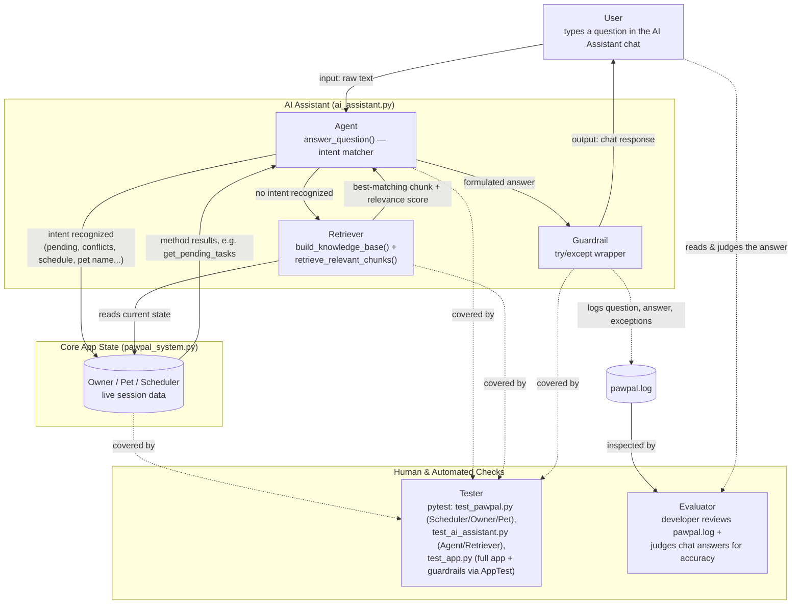

# PawPal+ (Module 2 Project)

You are building **PawPal+**, a Streamlit app that helps a pet owner plan care tasks for their pet.

## Summary

PawPal+ is a Streamlit app that helps a pet owner track pet care tasks (walks, feeding, meds, grooming, etc.), catches scheduling conflicts before they cause a missed or double-booked task, and automatically reschedules recurring tasks when they're completed. As of this phase, it also includes an AI Assistant that lets the owner ask plain-English questions about that same data — pets, tasks, conflicts, today's schedule — instead of scanning tables by hand. It matters because pet care is easy to lose track of across multiple pets and recurring routines; PawPal+ turns that into one place that both organizes the schedule and can answer questions about it on demand.

## Original Project (Modules 1-3)

The original project, **PawPal+**, was built across Modules 1-3 as a Streamlit app for pet care scheduling. Its goals were to let an owner register pets and care tasks, generate a daily schedule sorted by time, automatically flag same-pet/same-time scheduling conflicts, and handle recurring tasks by scheduling the next occurrence whenever one is marked complete. That logic lives in `pawpal_system.py` (`Owner`, `Pet`, `Task`, `Scheduler`) and is verified by the `tests/test_pawpal.py` suite.

## Architecture Overview

`diagrams/architecture.mmd` diagrams how the AI Assistant feature fits into the app (rendered below). A user's question goes to the **Agent** (`answer_question()`), which tries to match it to a known intent (a pet's name, "pending," "conflicts," "schedule," etc.) and, if it finds one, calls the relevant method directly on the app's live `Owner`/`Pet`/`Scheduler` data. If no intent matches, the **Retriever** (`build_knowledge_base()` + `retrieve_relevant_chunks()`) reads that same live data, ranks it by relevance to the question, and hands the single best match back as the answer — so even the fallback path is grounded in real data rather than a generic reply. Every answer passes through a **Guardrail** (`try/except`) before reaching the user, and questions, answers, and any exceptions are logged to `pawpal.log`. A **Tester** (`pytest`) verifies the underlying `Scheduler`/`Owner`/`Pet` logic the Agent depends on (`tests/test_pawpal.py`), the Agent and Retriever themselves (`tests/test_ai_assistant.py`), and the Guardrail plus full app workflow end-to-end (`tests/test_app.py`, via Streamlit's `AppTest`), and an **Evaluator** (a developer reviewing `pawpal.log`, plus the user themselves reading each answer) is the human check on whether the AI is actually behaving correctly.



## Scenario

A busy pet owner needs help staying consistent with pet care. They want an assistant that can:

- Track pet care tasks (walks, feeding, meds, enrichment, grooming, etc.)
- Consider constraints (time available, priority, owner preferences)
- Produce a daily plan and explain why it chose that plan

Your job is to design the system first (UML), then implement the logic in Python, then connect it to the Streamlit UI.

## What you will build

Your final app should:

- Let a user enter basic owner + pet info
- Let a user add/edit tasks (duration + priority at minimum)
- Generate a daily schedule/plan based on constraints and priorities
- Display the plan clearly (and ideally explain the reasoning)
- Include tests for the most important scheduling behaviors

## Getting started

### Setup

```bash
python -m venv .venv
source .venv/bin/activate  # Windows: .venv\Scripts\activate
pip install -r requirements.txt
```

Requires Python 3.9+.

### Run the app

```bash
streamlit run app.py
```

This opens the app in your browser (usually `http://localhost:8501`). No API keys or other configuration are needed — everything, including the AI Assistant, runs locally.

### Suggested workflow

1. Read the scenario carefully and identify requirements and edge cases.
2. Draft a UML diagram (classes, attributes, methods, relationships).
3. Convert UML into Python class stubs (no logic yet).
4. Implement scheduling logic in small increments.
5. Add tests to verify key behaviors.
6. Connect your logic to the Streamlit UI in `app.py`.
7. Refine UML so it matches what you actually built.

## 🖥️ Sample Output

Paste a sample of your app's CLI or Streamlit output here so a reader can see what a generated plan looks like:

```
========================================
        PawPal — Today's Schedule
========================================

Buddy (Golden Retriever)
------------------------------
  [Pending] Morning walk at 7:00 AM (daily)
  [Pending] Feed breakfast at 8:00 AM (daily)
  [Pending] Evening walk at 6:00 PM (daily)

Luna (Siamese)
------------------------------
  [Pending] Feed breakfast at 8:30 AM (daily)
  [Pending] Clean litter box at 12:00 PM (daily)
  [Pending] Brush fur at 5:00 PM (weekly)

========================================
Total pending tasks: 6
========================================  ...
```

## 🧪 Testing PawPal+

```bash
# Run the full test suite:
pytest
# (equivalent: python -m pytest)

# Run with coverage:
pytest --cov
```

The tests cover sorting, recurrence of tasks, conflict detection, the AI Assistant's intent-matching and retrieval logic (`tests/test_ai_assistant.py`), and full end-to-end app/guardrail behavior via Streamlit's `AppTest` harness (`tests/test_app.py`).

Sample test output:

```
=============== test session starts ===============
platform win32 -- Python 3.14.5, pytest-9.0.3, pluggy-1.6.0
rootdir: C:\Users\sajja\Downloads\ai110-module2show-pawpal-starter
plugins: anyio-4.13.0
collected 12 items                                 

tests\test_pawpal.py ............            [100%]

=============== 12 passed in 0.14s ================
```

## 📐 Smarter Scheduling

> Fill in once you've implemented scheduling logic.

| Feature | Method(s) | Notes |
|---------|-----------|-------|
| Task sorting |sort_by_time() | e.g., by priority, duration |
| Filtering | filter_tasks()| e.g., skip tasks if time runs out |
| Conflict handling |detect_conflicts() | e.g., overlapping time slots |
| Recurring tasks | _schedule_next() | e.g., daily vs. weekly |

## 📸 Demo Walkthrough

### UI features

The Streamlit app (`app.py`) is organized into four sections, plus an AI Assistant pinned at the top:

- **AI Assistant** — click "🤖 AI Assistant" to open a chat panel where you can ask questions about the owner, pets, tasks, and schedule in plain English. Fully rule-based (no external API/LLM/key required) — see the "🤖 AI Assistant" section below for details.
- **Owner** — enter a name, email, and phone number and click "Create Owner." Once created, the owner's contact info is displayed below the form.
- **Add a Pet** — enter a pet's name, species, breed, age, and weight and click "Add Pet." Registered pets appear in a table as they're added.
- **Schedule a Task** — pick a pet, describe the task, set a time and frequency (`daily`, `weekly`, or `monthly`), and click "Add Task" to attach it to that pet. Times must be in `H:MM AM/PM` format (e.g. `8:00 AM`) — invalid formats are rejected with an on-screen error instead of crashing the app.
- **Today's Schedule** — shows each pet's pending tasks sorted chronologically, surfaces any scheduling conflicts as warnings, and provides a "Mark Done" control to complete a task on the spot.

### Example workflow

1. Create an owner (e.g., "Jordan").
2. Add a pet (e.g., "Mochi," a Shiba Inu).
3. Schedule a task for Mochi — e.g., "Morning walk" at 8:00 AM, daily.
4. Open "Today's Schedule" to see Mochi's task listed alongside any other pets' tasks, sorted by time.
5. Click "Mark Done" on the task — the Scheduler marks it complete and, for daily/weekly tasks, automatically schedules the next occurrence.

### Key Scheduler behaviors shown

- **Sorting** — `sort_by_time()` orders every pet's task list chronologically, regardless of the order tasks were entered in.
- **Conflict warnings** — `detect_conflicts()` displays a warning banner whenever two tasks for the same pet share the same time and date (e.g. two 6:00 PM tasks).
- **Filtering** — `filter_tasks()` powers the pending-only view, so completed tasks drop out of the schedule automatically.
- **Recurrence** — clicking "Mark Done" on a daily/weekly task calls `complete_task()`, which schedules that task's next occurrence behind the scenes.

### Sample CLI output (`python main.py`)

```
==================================================
  Conflict Detection
==================================================
  WARNING: Buddy has a time conflict at 6:00 PM on 2026-06-30 — "Evening walk" and "Feed dinner"

==================================================
  Today's Full Schedule (sorted by time)
==================================================
  [Pending] Morning walk at 7:00 AM on 2026-06-30 (daily)
  [Pending] Feed breakfast at 8:00 AM on 2026-06-30 (daily)
  [Pending] Feed breakfast at 8:30 AM on 2026-06-30 (daily)
  [Pending] Clean litter box at 12:00 PM on 2026-06-30 (daily)
  [Pending] Brush fur at 5:00 PM on 2026-06-30 (weekly)
  [Pending] Evening walk at 6:00 PM on 2026-06-30 (daily)
  [Pending] Feed dinner at 6:00 PM on 2026-06-30 (daily)
```

## 🤖 AI Assistant

A chat panel (`ai_assistant.py`) that answers questions about the current owner, pets, tasks, and schedule — entirely offline, with no API key or external LLM. It works by matching keywords in your question (e.g. "conflict", "pending", a pet's name) to an intent, then calling the relevant `Owner`/`Pet`/`Scheduler` method directly to build the answer, so responses are always grounded in the app's real data. If no intent matches, it falls back to surfacing the most relevant data it can find rather than a flat "I don't know."

Try asking things like:

- "What tasks does Mochi have?"
- "Are there any scheduling conflicts?"
- "What's today's schedule?"
- "How many pending tasks does Buddy have?"

The panel stays open across questions and only closes when you click the "✕" button.

### Sample Interactions

These are real captured input/output pairs from the running app (owner "Jordan," pet "Mochi" with a "Morning walk" task at 8:00 AM daily), demonstrating that the assistant is actually functional rather than a static demo:

> **Q:** "What tasks does Mochi have?"
> **A:** "Mochi's tasks:\n- [Pending] Morning walk at 8:00 AM (daily)"

> **Q:** "Are there any conflicts?"
> **A:** "No scheduling conflicts detected."

> **Q:** "Tell me about Jordan" *(no keyword intent matches — this exercises the retrieval fallback)*
> **A:** "Owner contact info: Jordan | Email: jordan@email.com | Phone: 555-0100."

> **Q:** "asdkjaskdj random gibberish" *(nothing in the app's data is relevant)*
> **A:** "I couldn't find anything relevant to that in the app's current data. Try asking about a pet's tasks, pending/completed status, scheduling conflicts, or today's schedule."

## 📝 Logging

The app logs key actions (owner/pet/task creation, task completion, rejected invalid input, AI Assistant questions) to `pawpal.log` in the project root, via Python's standard `logging` module. This file is gitignored and regenerates on each run — check it if something doesn't behave as expected.

## Design Decisions

- **Rule-based intent matching instead of an LLM.** The assistant was originally built calling the Claude API, then rebuilt to answer entirely from keyword/intent matching over the app's own data. Trade-off: it can't paraphrase or handle odd phrasing as gracefully as an LLM would, but it needs no API key, no network call, no per-query cost, and its answers can never be inconsistent with the app's actual data since they're computed directly from it rather than generated.
- **Fallback returns the single best-matching chunk, not a list.** An earlier version of the retrieval fallback prepended a generic "I'm not sure..." disclaimer and dumped several ranked chunks underneath it. That's exactly the "printing retrieved data alongside a standard answer" anti-pattern rather than the AI actively using it — it was changed to return only the top-ranked chunk directly as the answer, and only falls back to guidance text when nothing is actually relevant (score 0).
- **The assistant is pinned inline at the top of the page instead of floating.** The first attempt used CSS `position: fixed` to make it a floating bottom-right chat bubble. That silently failed: Streamlit wraps blocks in wrapper divs that use CSS `transform` for its rerun animations, which changes what `position: fixed` is measured relative to and effectively clips the element off-screen instead of just repositioning it — a known limitation of building floating widgets in Streamlit with plain CSS. Trade-off: placing it inline at the top isn't a true floating overlay, but it's guaranteed to render, needs no CSS hacks, and means the user never has to scroll to reach it or see its latest answer anyway.
- **Custom session-state panel instead of `st.popover`.** `st.popover` was tried first since it's the built-in Streamlit widget for this. It has two problems for a chat use case: its open/closed state isn't controlled by the app, so submitting a message via `st.chat_input` closed it every time, and its content area has its own internal max-height/scroll behavior that kept the latest answer scrolled out of view. Replacing it with a plain container gated on a `st.session_state` boolean — cleared only by an explicit "✕" button — gives full control over both behaviors at the cost of losing the popover's built-in click-outside-to-dismiss convenience.

## Testing Summary

**Automated tests:** `tests/test_ai_assistant.py` (new) has 23 unit tests calling `answer_question()` and `retrieve_relevant_chunks()` directly — every intent (owner info, pet list, conflicts, schedule, pending/completed per pet, aggregate totals), edge cases (no owner, no pets, a pet with no tasks), the retrieval fallback (both a real match and a genuinely irrelevant query), and a guardrail test asserting the assistant never raises or returns an empty string on degenerate input (`""`, whitespace, punctuation-only, emoji, a 500-character string). Combined with the original `tests/test_pawpal.py` (12 tests for sorting, recurrence, and conflict detection), the full suite is:

> **35 of 35 automated tests pass.** Writing them surfaced one real bug — the tokenizer glued possessive `'s` onto words (e.g. "Mochi's" → one token `"mochi's"`), which silently broke pet-name recognition for natural phrasing like *"What are Mochi's tasks?"*. It was fixed (dropped apostrophes from the token pattern) and is now covered by a dedicated regression test. No tests are currently failing.

**Confidence scoring:** the retrieval fallback computes a lexical relevance score (count of overlapping words) for the best-matching chunk and logs it (`pawpal.log`) with every fallback answer. A score of 0 means nothing in the app's data was relevant, in which case the assistant admits that instead of guessing; a score above 0 means it found and returned real matching data.

**Human evaluation** (manually run against the live app and judged for correctness):

| Test Input | Evaluation Criteria | Result |
|---|---|---|
| "What tasks does Mochi have?" | Lists that pet's actual tasks, with status and time | Pass |
| "Are there any conflicts?" | Reports no conflicts when none exist | Pass |
| Two same-pet tasks at the same time, then "any conflicts?" | Conflict is detected and names both tasks correctly | Pass |
| "Tell me about Jordan" (no intent keyword matches) | Fallback returns the single most relevant real data directly, not a generic disclaimer + data dump | Pass |
| "asdkjaskdj random gibberish" | Handles irrelevant input gracefully — no crash, no fabricated answer | Pass |
| Invalid task time, e.g. "8am" | Rejected with an on-screen error; app does not crash | Pass |
| "What are Mochi's tasks?" (possessive phrasing) | Pet name recognized despite the `'s` | Fail — initially not recognized (tokenizer bug); Pass after fix |
| Empty / whitespace / emoji-only chat input | No exception, always returns a non-empty string | Pass |

**What didn't work initially, and what it taught us:** two real bugs here — a floating CSS chat bubble that silently failed to render (Streamlit's rerun-animation wrapper divs break `position: fixed`), and `st.popover` closing itself on every chat submission — were invisible to both pytest and `AppTest`, since neither evaluates actual browser CSS/layout behavior. They only surfaced from hands-on use of the running app. The lesson: logic-level automated tests are necessary but not sufficient for a Streamlit UI — they catch behavioral/data bugs (like the possessive-tokenizer bug above) reliably, but rendering/layout bugs still require actually opening the app in a browser.

## 🧾 Reproducible Execution Evidence

Everything below is real, verbatim output captured by actually running the commands shown — not a description of what should happen. The end-to-end run and the guardrail checks below are permanently codified as real, rerunnable tests in `tests/test_app.py` (not one-off scripts) — clone the repo and run `pytest tests/test_app.py -v` to reproduce them yourself.

### End-to-end system run (3 inputs)

This walks through the core app itself, start to finish: create an owner, add a pet, schedule a task, and see the resulting schedule/conflict check — each input paired directly with its actual output, captured via Streamlit's `AppTest` harness (which executes `app.py` exactly as a real browser session would, not a mock). This exact flow is `tests/test_app.py::test_end_to_end_owner_pet_task_workflow`.

**Input 1 — Create Owner** (name=`Jordan`, email=`jordan@email.com`, phone=`555-0100`):
```
Output: ["Owner 'Jordan' created!", "No schedule yet. Add pets and tasks above."]
```

**Input 2 — Add Pet** (name=`Mochi`, species=`Dog`, breed=`Shiba Inu`, age=`2`, weight=`15.0`):
```
Output: ["Mochi added!", "No scheduling conflicts detected.", "Mochi has no pending tasks. All caught up!"]
```

**Input 3 — Schedule a Task** (pet=`Mochi`, description=`Morning walk`, time=`8:00 AM`, frequency=`daily`):
```
Output: ["Task 'Morning walk' added to Mochi!", "No scheduling conflicts detected."]
Total pending tasks metric: 1
```

Three inputs, three real outputs, ending in a consistent, correct app state — the schedule reflects exactly the one task just added, with no false conflicts reported.

### Sample command execution: launching the app

```bash
$ streamlit run app.py
```

```
2026-07-27 15:37:54.014 Uvicorn server started on 0.0.0.0:8501

  You can now view your Streamlit app in your browser.

  Local URL: http://localhost:8501
  Network URL: http://192.168.1.19:8501
  External URL: http://68.9.134.220:8501
```

### Example inputs and outputs: AI Assistant (Agent + Retriever behavior)

This demonstrates the two-part AI architecture from the [Architecture Overview](#architecture-overview) actually firing: the first two questions are answered by the **Agent** matching a known intent and calling a live `Owner`/`Pet`/`Scheduler` method directly; the last two fall through to the **Retriever**, which ranks the app's own data by relevance to the question instead of the Agent returning a canned reply — proving the retrieved data is what drives the answer, not just text printed alongside a generic response.

Reproduce with:

```python
from pawpal_system import Owner, Pet, Task
from ai_assistant import answer_question

owner = Owner(name="Jordan", email="jordan@email.com", phone="555-0100")
pet = Pet(name="Mochi", species="Dog", breed="Shiba Inu", age=2, weight=15.0)
pet.add_task(Task(description="Morning walk", time="8:00 AM", frequency="daily"))
owner.add_pet(pet)

questions = [
    "What tasks does Mochi have?",
    "Are there any conflicts?",
    "Tell me about Jordan",
    "asdkjaskdj random gibberish",
]

for q in questions:
    print(f"Q: {q}")
    print(f"A: {answer_question(q, owner)}")
    print()
```

Captured output (mechanism noted per case — not part of the actual program output, added here for clarity):

```
Q: What tasks does Mochi have?                     [Agent: pet-name + task intent matched]
A: Mochi's tasks:
- [Pending] Morning walk at 8:00 AM (daily)

Q: Are there any conflicts?                        [Agent: conflict intent matched]
A: No scheduling conflicts detected.

Q: Tell me about Jordan                            [Retriever: no intent matched, fell back to retrieval]
A: Owner contact info: Jordan | Email: jordan@email.com | Phone: 555-0100.

Q: asdkjaskdj random gibberish                     [Retriever: fell back to retrieval, found nothing relevant]
A: I couldn't find anything relevant to that in the app's current data. Try asking about a pet's tasks, pending/completed status, scheduling conflicts, or today's schedule.
```

### Reliability/guardrail results

Full automated test suite, run fresh (`pytest -v`), current as of the AI Assistant feature — `tests/test_pawpal.py` (original scheduling logic), `tests/test_ai_assistant.py` (Agent/Retriever logic), and `tests/test_app.py` (full app + guardrails, via `AppTest`):

```
============================= test session starts =============================
platform win32 -- Python 3.14.5, pytest-9.0.3, pluggy-1.6.0
rootdir: C:\Users\sajja\Downloads\applied-ai-system-project
plugins: anyio-4.13.0, cov-7.1.0
collecting ... collected 41 items

tests/test_ai_assistant.py::test_answers_gracefully_when_no_owner_exists PASSED [  2%]
tests/test_ai_assistant.py::test_answers_gracefully_when_owner_has_no_pets PASSED [  4%]
tests/test_ai_assistant.py::test_greeting_returns_example_questions PASSED [  7%]
tests/test_ai_assistant.py::test_help_describes_capabilities PASSED      [  9%]
tests/test_ai_assistant.py::test_owner_intent_returns_contact_info PASSED [ 12%]
tests/test_ai_assistant.py::test_pet_list_intent_lists_all_pets PASSED   [ 14%]
tests/test_ai_assistant.py::test_conflict_intent_reports_no_conflicts PASSED [ 17%]
tests/test_ai_assistant.py::test_conflict_intent_reports_actual_conflict PASSED [ 19%]
tests/test_ai_assistant.py::test_schedule_intent_returns_daily_schedule PASSED [ 21%]
tests/test_ai_assistant.py::test_pet_tasks_intent_lists_tasks_for_named_pet PASSED [ 24%]
tests/test_ai_assistant.py::test_pet_name_recognized_in_possessive_form PASSED [ 26%]
tests/test_ai_assistant.py::test_pet_pending_intent_when_task_incomplete PASSED [ 29%]
tests/test_ai_assistant.py::test_pet_pending_intent_when_all_caught_up PASSED [ 31%]
tests/test_ai_assistant.py::test_pet_completed_intent_lists_completed_tasks PASSED [ 34%]
tests/test_ai_assistant.py::test_pet_completed_intent_when_none_completed PASSED [ 36%]
tests/test_ai_assistant.py::test_pet_with_no_tasks_reports_that_directly PASSED [ 39%]
tests/test_ai_assistant.py::test_pending_intent_without_pet_name_totals_across_all_pets PASSED [ 41%]
tests/test_ai_assistant.py::test_task_word_without_pet_name_lists_every_task PASSED [ 43%]
tests/test_ai_assistant.py::test_fallback_surfaces_relevant_data_directly_when_no_intent_matches PASSED [ 46%]
tests/test_ai_assistant.py::test_fallback_gives_guidance_when_nothing_is_relevant PASSED [ 48%]
tests/test_ai_assistant.py::test_retrieve_relevant_chunks_ranks_by_word_overlap PASSED [ 51%]
tests/test_ai_assistant.py::test_retrieve_relevant_chunks_returns_zero_score_when_nothing_matches PASSED [ 53%]
tests/test_ai_assistant.py::test_answer_question_never_raises_on_odd_input PASSED [ 56%]
tests/test_app.py::test_app_loads_without_exceptions PASSED              [ 58%]
tests/test_app.py::test_end_to_end_owner_pet_task_workflow PASSED        [ 60%]
tests/test_app.py::test_invalid_task_time_is_rejected_without_crashing PASSED [ 63%]
tests/test_app.py::test_valid_task_time_is_accepted_after_a_rejection PASSED [ 65%]
tests/test_app.py::test_ai_assistant_opens_and_stays_open_across_chat_submission PASSED [ 68%]
tests/test_app.py::test_ai_assistant_closes_only_via_close_button PASSED [ 70%]
tests/test_pawpal.py::test_mark_complete_changes_status PASSED           [ 73%]
tests/test_pawpal.py::test_add_task_increases_pet_task_count PASSED      [ 75%]
tests/test_pawpal.py::test_sort_by_time_orders_chronologically PASSED    [ 78%]
tests/test_pawpal.py::test_sort_by_time_handles_midnight_and_noon_boundary PASSED [ 80%]
tests/test_pawpal.py::test_sort_by_time_does_not_mutate_original_list PASSED [ 82%]
tests/test_pawpal.py::test_complete_daily_task_creates_next_day_occurrence PASSED [ 85%]
tests/test_pawpal.py::test_complete_weekly_task_creates_next_week_occurrence PASSED [ 87%]
tests/test_pawpal.py::test_complete_monthly_task_does_not_recur PASSED   [ 90%]
tests/test_pawpal.py::test_complete_task_returns_false_for_unknown_pet_or_task PASSED [ 92%]
tests/test_pawpal.py::test_detect_conflicts_flags_duplicate_times_for_same_pet PASSED [ 95%]
tests/test_pawpal.py::test_detect_conflicts_ignores_same_time_on_different_pets PASSED [ 97%]
tests/test_pawpal.py::test_detect_conflicts_returns_empty_when_no_overlap PASSED [100%]

============================= 41 passed in 2.31s ==============================
```

Guardrail check — this is `tests/test_app.py::test_invalid_task_time_is_rejected_without_crashing` and `test_valid_task_time_is_accepted_after_a_rejection`, shown here run standalone against the live app via Streamlit's `AppTest` harness for a clearer before/after view (submitting an invalid time, then a valid one):

```
--- Invalid time ("8am") submitted ---
Exception raised: False
On-screen error shown: ["'8am' isn't a valid time. Use the format 'H:MM AM/PM', e.g. '8:00 AM'."]

--- Valid time ("8:00 AM") submitted ---
Exception raised: False
Success messages: ["Task 'Morning walk' added to Mochi!", 'No scheduling conflicts detected.']
```

Corresponding `pawpal.log` contents from that same run, showing the rejection was actually logged (not just displayed):

```
2026-07-28 15:44:37,549 [INFO] __main__: Owner created: name=Jordan
2026-07-28 15:44:37,581 [INFO] __main__: Pet added: name=Mochi species=Dog breed=Shiba Inu
2026-07-28 15:44:40,569 [WARNING] __main__: Rejected task with invalid time format: '8am'
2026-07-28 15:44:40,632 [INFO] __main__: Task added: pet=Mochi desc=Morning walk time=8:00 AM freq=daily
```

## Reflection

Working through this phase reinforced that "add an AI feature" doesn't have to mean "add an LLM" — a well-scoped rule-based system, built directly on the same data model as the rest of the app, can satisfy an AI-assistant requirement with more predictability, zero cost, and no external dependency. It also reinforced that UI bugs (a widget that silently fails to render, a panel that closes itself) don't show up in code review or passing tests — they only show up when you actually run the thing and try to use it, which is exactly the debugging loop this feature went through more than once.

> The graded responsible-AI reflection (how AI was used collaboratively, one helpful and one flawed AI suggestion, and this system's limitations) is documented separately in `model_card.md`, not here.
